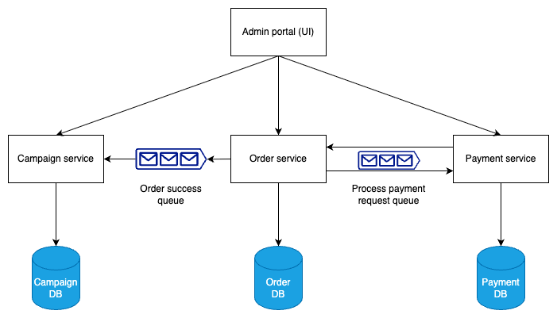
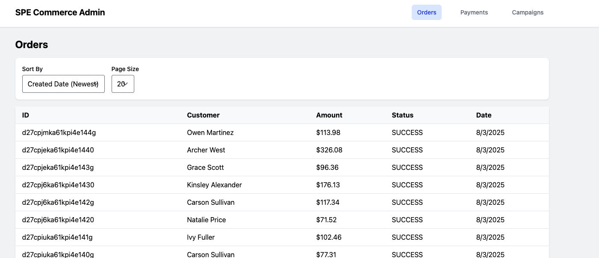
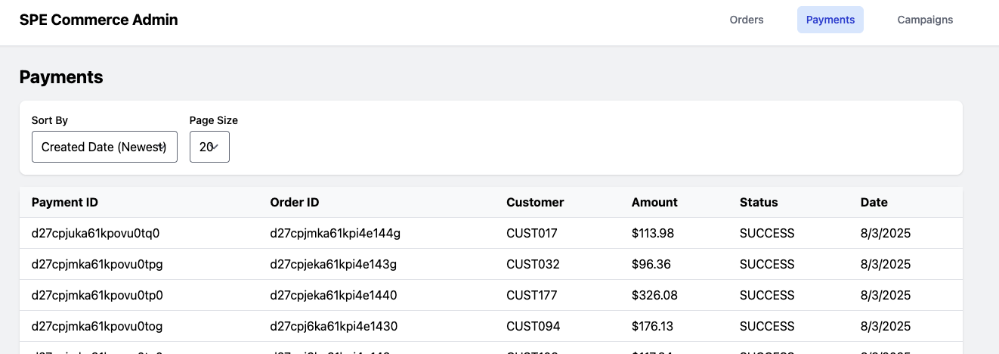
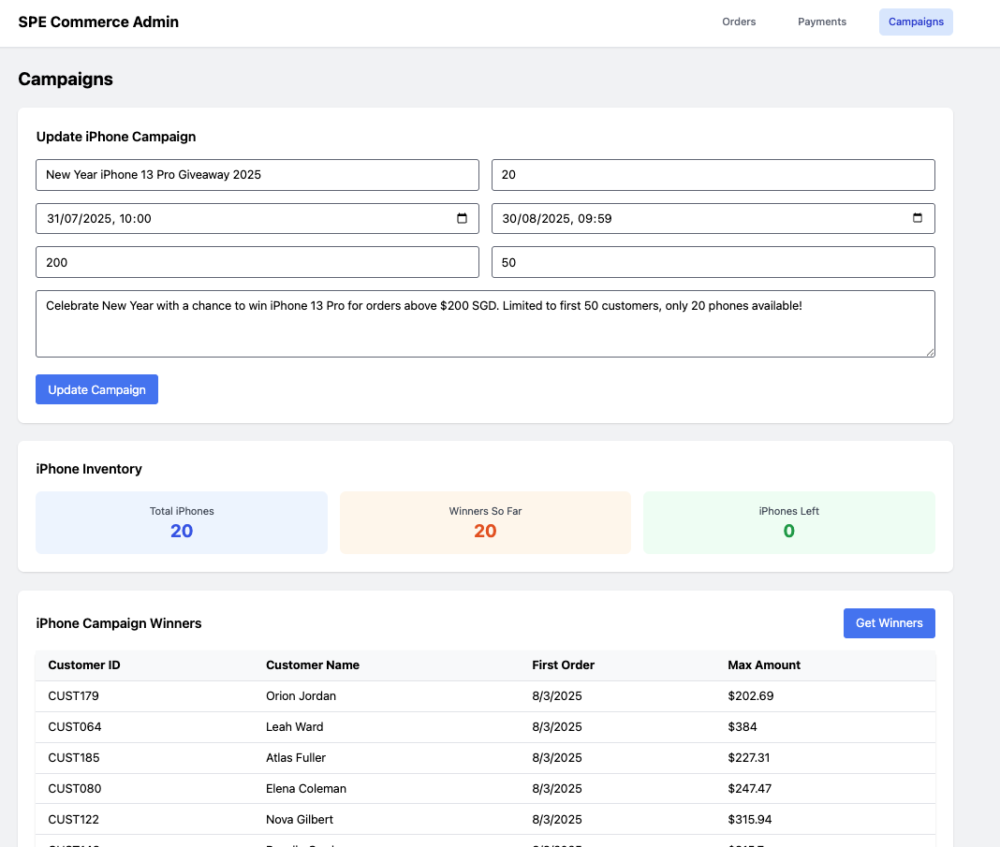
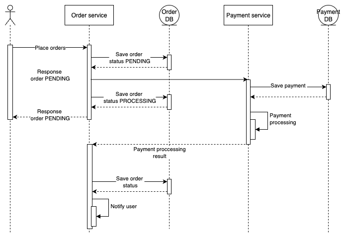
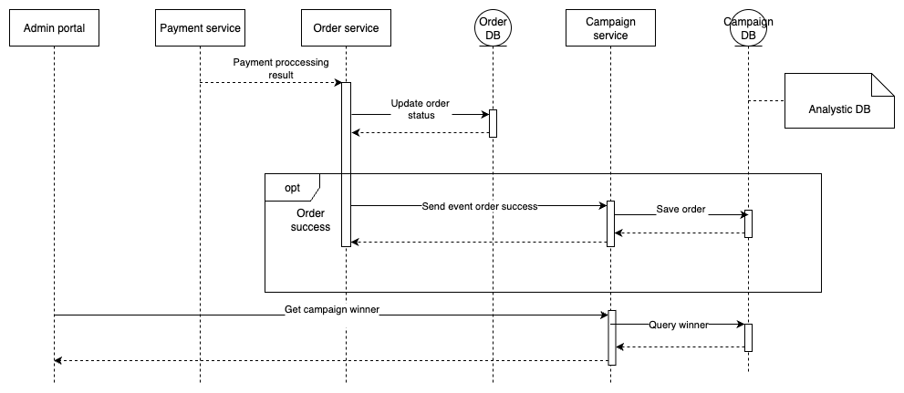

# SPgroup E-Commerce Platform
## Interview Coding Assignment - Empowering the Future of Energy

### Overview
This project implements a high-throughput, low-latency e-commerce platform that supports order placement and hot-sale campaigns with concurrent order processing.

### Functional Requirements
1. The system allows customers to place orders and make payments. **(Done)**
2. The system supports a hot-sale campaign that gives away 20 free iPhones for transactions matching requirements: **(Done)**
    - First 50 customers with successful transactions
    - Order amount greater than SGD 200 (configurable)
    - One gift per customer (no duplicate wins)
3. The system supports an admin portal for management components: **(Done)**
    - Management of orders with pagination and sorting
    - Management of payments with pagination and sorting
    - Create and manage hot-sale campaigns
    - Track iPhone inventory for the campaign

### Non-Functional Requirements
1. The system should be able to handle more than 10,000 transactions per minute.
2. The system should be able to handle more than 100,000 concurrent users.

### Architecture
The system follows a microservices architecture with event-driven communication:



### Services

#### 1. Order Service (Port: 8080)
- **Database**: Order DB (Port: 5432)

**Schema:**
```sql
-- Enums
CREATE TYPE order_status AS ENUM ('PENDING', 'PROCESSING', 'SUCCESS', 'FAILED');

-- Tables
CREATE TABLE orders (
    id VARCHAR(20) PRIMARY KEY NOT NULL,
    status order_status NOT NULL DEFAULT 'PENDING',
    total_amount DECIMAL(10, 2) NOT NULL,
    customer_id VARCHAR(20) NOT NULL,
    customer_name VARCHAR(100) NOT NULL,
    created_at TIMESTAMP WITH TIME ZONE NOT NULL DEFAULT NOW(),
    updated_at TIMESTAMP WITH TIME ZONE NOT NULL DEFAULT NOW()
);

-- Indexes
CREATE INDEX orders_customer_id_created_at ON orders(customer_id, created_at);
```

**API Endpoints:**
- `POST /api/v1/orders` - Create new order
- `GET /api/admin/v1/orders` - Get all orders
- `GET /api/admin/v1/orders/search` - Search orders with pagination/filtering

#### 2. Payment Service (Port: 8081)
- **Database**: Payment DB (Port: 5433)

**Schema:**
```sql
-- Enums
CREATE TYPE payment_status AS ENUM ('SUCCESS', 'FAILED');

-- Tables
CREATE TABLE payments (
    id VARCHAR(20) PRIMARY KEY NOT NULL,
    order_id VARCHAR(20) NOT NULL,
    status payment_status NOT NULL DEFAULT 'SUCCESS',
    total_amount DECIMAL(10, 2) NOT NULL,
    customer_id VARCHAR(20) NOT NULL,
    created_at TIMESTAMP WITH TIME ZONE NOT NULL DEFAULT NOW(),
    updated_at TIMESTAMP WITH TIME ZONE NOT NULL DEFAULT NOW()
);
```

**API Endpoints:**
- `GET /api/admin/v1/payments` - Get all payments
- `GET /api/admin/v1/payments/search` - Search payments with pagination/filtering

#### 3. Campaign Service (Port: 8082)
- **Database**: Campaign DB (Port: 5434)

**Schema:**
```sql
-- Enums
CREATE TYPE order_status AS ENUM ('PENDING', 'PROCESSING', 'SUCCESS', 'FAILED');

-- Tables
CREATE TABLE campaigns (
    id BIGSERIAL PRIMARY KEY,
    name VARCHAR(100) NOT NULL,
    type VARCHAR(50) UNIQUE NOT NULL,
    description TEXT NOT NULL,
    start_time TIMESTAMP WITH TIME ZONE NOT NULL,
    end_time TIMESTAMP WITH TIME ZONE NOT NULL,
    policy JSONB NOT NULL DEFAULT '{}',
    created_at TIMESTAMP WITH TIME ZONE NOT NULL DEFAULT NOW(),
    updated_at TIMESTAMP WITH TIME ZONE NOT NULL DEFAULT NOW()
);

-- Order tracking for campaigns (denormalized)
CREATE TABLE orders (
    id VARCHAR(20) PRIMARY KEY NOT NULL,
    status order_status NOT NULL DEFAULT 'PENDING',
    total_amount DECIMAL(10, 2) NOT NULL,
    customer_id VARCHAR(20) NOT NULL,
    customer_name VARCHAR(100) NOT NULL,
    created_at TIMESTAMP WITH TIME ZONE NOT NULL DEFAULT NOW(),
    updated_at TIMESTAMP WITH TIME ZONE NOT NULL DEFAULT NOW()
);

-- Constraints and Indexes
ALTER TABLE campaigns ADD CONSTRAINT campaigns_type_unique UNIQUE (type);
CREATE INDEX orders_customer_id_created_at ON orders(customer_id, created_at);
```

**API Endpoints:**
- `POST /api/admin/v1/campaigns/iphones` - Create iPhone campaign
- `GET /api/admin/v1/campaigns/iphones` - Get iPhone campaign details
- `PUT /api/admin/v1/campaigns/iphones/:id` - Update iPhone campaign
- `GET /api/admin/v1/campaigns/iphones/winners` - Get iPhone campaign winners

#### 4. Admin Portal (Port: 3000)
- **Technology**: React + TypeScript + Tailwind CSS
- **Features**:
    - Order management
  
    - Payment management
    
    - Campaign management
    

### Core Features

#### 1. Order Placement
**Business Requirements:**
Customers can place orders and process payments.

**Technical Implementation:**
- Order management and payment processing are handled by separate microservices following DDD principles
- The order placement process is asynchronous; order service and payment service are decoupled using Kafka for event-driven communication
- The system can be easily scaled by sharding applications, databases, and Kafka partitions based on customer_id

**Sequence Diagram:**


#### 2. Campaign Winner Detection
**Business Requirements:**
Customers who place orders during a hot-sale campaign may win a free iPhone if they meet the campaign requirements:
- First 50 customers with successful transactions
- Order amount greater than SGD 200 (configurable)
- One gift per customer (no duplicate wins)
- Limited to 20 free iPhones (first-come-first-serve)

**Main Challenge:**
- Following the business requirements, **fairness** of campaign winner selection is the most important consideration
- First, detect the first 50 customers by order creation time, then among them find those with transaction amounts greater than SGD 200, and finally select the first 20 winners based on their order creation time
- Assuming the order placement system has been scaled out to multiple instances, winner detection needs to collect data from all order instances and process it consistently

**Batch Processing (Currently Implemented):**
- The campaign service periodically checks for eligible orders and updates the winners list
- Order success events are synchronized to the campaign service via Kafka
- The database that processes winners is separated from the order database and may use an analytics database or data warehouse for batch processing

```sql
-- Winner selection query
WITH first_customers AS (
    SELECT customer_id, customer_name, MIN(created_at) as first_order_date,
           MAX(total_amount) as max_order_amount
    FROM orders 
    WHERE created_at >= '2025-08-01 00:00:00+00:00' 
      AND created_at <= '2025-08-31 23:59:59+00:00'
    GROUP BY customer_id, customer_name
    ORDER BY MIN(created_at)
    LIMIT 50
)
SELECT customer_id, customer_name, first_order_date, max_order_amount
FROM first_customers 
WHERE max_order_amount > 200
ORDER BY first_order_date 
LIMIT 20;
```



**Micro-batch Processing (Future Enhancement):**
- Synchronized order data is partitioned by customer_id. The first 50 customers can only be detected accurately if all partition messages are buffered in the same place
- We can use Flink as a stream processing engine to process order data in micro-batch mode
- For our use case, a 1-minute micro-batch is sufficient to detect winners (only 20 winners needed when processing 10,000 transactions per minute)
